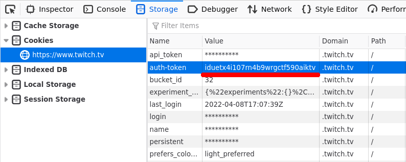

Authentication
==============

Some videos are visible to channel subscribers only. Twitch will attempt a
workaround and download them anyway, but if this does not work you can use your
own user account to download the stream.

To accomplish this you need to find your auth token. It can be found using your
browser, in a cookie named `auth_token`.

1. Open twitch.tv in your browser and make sure you're logged in.
2. Open developer tools (F12 shortcut in Firefox and Chrome).
3. Open the `Storage` tab on Firefox, or `Application` tab in Chrome.
4. Click on `Cookies` → `https://www.twitch.tv/` in the sidebar.
5. Find the `auth-token` cookie in the list and copy it's value.



The auth token will be a 30 character long string of random letters and numbers,
something like `iduetx4i107rn4b9wrgctf590aiktv`. Then you can pass it to `info`
and `download` commands:

```
twitch-dl info 221837124 --auth-token iduetx4i107rn4b9wrgctf590aiktv
twitch-dl download 221837124 --auth-token iduetx4i107rn4b9wrgctf590aiktv
```
